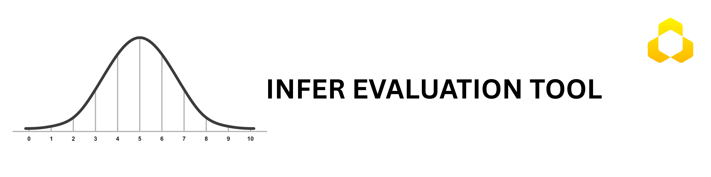

# infer-ci



[](https://opensource.org/licenses/MIT)
[](https://www.python.org/downloads/)
[](https://pypi.org/project/infer-ci/)
[](https://infer.humblebee.ai)

**infer-ci** computes ML evaluation metrics (Accuracy, F1, MAE, mAP, …) together with their confidence intervals — so your model release decisions are backed by statistics, not single-point scores.

## Table of Contents

- [Installation](#installation)
- [Quick Start](#quick-start)
- [Why confidence intervals?](#why-confidence-intervals)
- [Supported Methods](#supported-methods)
- [Supported Metrics](#supported-metrics)
- [Classification Report](#classification-report)
- [Averaging Support](#averaging-support)
- [Contributing](#contributing)
- [Citation](#citation)
- [References](#references)
- [License](#license)

## Installation

### From PyPI (Recommended)

```bash
pip install infer-ci
```

### From Source (Development)

```bash
git clone https://github.com/humblebeeai/infer-ci.git
cd infer-ci
pip install -e ".[dev]"
```

## Quick Start

```python
from infer_ci import MetricEvaluator

evaluator = MetricEvaluator()

# Classification example
y_true = [0, 1, 1, 0, 1, 0, 1, 1, 0, 0]
y_pred = [0, 1, 0, 0, 1, 0, 1, 0, 0, 1]

accuracy, ci = evaluator.evaluate(
    y_true=y_true,
    y_pred=y_pred,
    task='classification',
    metric='accuracy',
    method='wilson'
)
print(f"Accuracy: {accuracy:.3f}  95% CI: [{ci[0]:.3f}, {ci[1]:.3f}]")
# Accuracy: 0.700  95% CI: [0.376, 0.904]

# Regression example
y_true_reg = [1.0, 2.0, 3.0, 4.0, 5.0]
y_pred_reg = [1.1, 2.2, 2.8, 4.1, 4.9]

mae_val, ci = evaluator.evaluate(
    y_true=y_true_reg,
    y_pred=y_pred_reg,
    task='regression',
    metric='mae',
    method='bootstrap_bca'
)
print(f"MAE: {mae_val:.3f}  95% CI: [{ci[0]:.3f}, {ci[1]:.3f}]")
# MAE: 0.140  95% CI: [0.080, 0.200]
```

You can also import individual metric functions directly:

```python
from infer_ci import accuracy_score, f1_score, mae, mse, rmse, r2_score
```

Discover available metrics and methods programmatically:

```python
print(evaluator.get_available_metrics('classification'))
print(evaluator.get_available_metrics('regression'))
print(evaluator.get_available_methods('classification'))
print(evaluator.get_available_methods('regression'))
```

Try the [online version](https://infer.humblebee.ai) without installing anything.

## Why confidence intervals?

Teams often ship (or reject) models based on single-number metrics computed on small or shifting test sets. When a metric is noisy, tiny changes in data, random seeds, or sampling can look like regressions or breakthroughs that are not real — creating wasted iteration, broken trust with stakeholders, and brittle release decisions.

**Example:** A YOLO detector evaluated on a small test set reported mAP ≈ 40%. After expanding the dataset, mAP dropped to ≈ 36%, and the client assumed the model had degraded. The real cause was statistical uncertainty: the original 40% had a 95% CI of roughly (20%, 60%), while the 36% on the larger set had a much tighter (30%, 42%). Communicating those intervals resolved the dispute and aligned the team on the true model trajectory.

**infer-ci** treats evaluation as statistical inference — attaching a confidence interval to every metric so release decisions are made on stable evidence. It supports multiple CI methods (bootstrapping, Wilson, Wald, Takahashi, and more) across classification, regression, and object detection tasks.

## Supported Methods

| Type | Methods |
|------|---------|
| **Analytical** | Wilson, Normal, Agresti-Coull, Beta, Jeffreys, Binomial test |
| **Bootstrap** | Bootstrap Basic, Bootstrap Percentile, Bootstrap BCA (default) |
| **Jackknife** | Jackknife |

By default all metrics use **Bootstrap BCA** (`method='bootstrap_bca'`) — an advanced bootstrap that corrects for both bias and skewness. To switch:

```python
evaluator.evaluate(..., method='wilson')           # analytical
evaluator.evaluate(..., method='jackknife')        # jackknife
evaluator.evaluate(..., method='bootstrap_percentile')  # basic bootstrap
```

The analytical methods use the 2022 paper by Takahashi et al. for precision, recall, and F1 (see [References](#references)).

## Supported Metrics

### Classification

| Key | Metric |
|-----|--------|
| `accuracy` | Overall accuracy |
| `precision` | Positive Predictive Value (PPV) |
| `recall` | True Positive Rate / Sensitivity (TPR) |
| `specificity` | True Negative Rate (TNR) |
| `npv` | Negative Predictive Value |
| `fpr` | False Positive Rate |
| `f1` | F1 Score (supports binary/macro/micro averaging) |
| `precision_takahashi` | Precision via Takahashi method |
| `recall_takahashi` | Recall via Takahashi method |
| `auc` | ROC AUC Score |

### Regression

| Key | Metric |
|-----|--------|
| `mae` | Mean Absolute Error |
| `mse` | Mean Squared Error |
| `rmse` | Root Mean Squared Error |
| `r2` | Coefficient of Determination |
| `mape` | Mean Absolute Percentage Error |
| `iou` | Intersection Over Union |

### Object Detection (overall + per-class)

| Key | Metric |
|-----|--------|
| `map` | mAP @ 0.5:0.95 |
| `map50` | mAP @ 0.5 |
| `precision` | Precision |
| `recall` | Recall |

See the [Object Detection Metrics Usage Guide](docs/object-detection-metrics-usage.md) for full examples.

## Classification Report

`classification_report_with_ci` prints per-class metrics with confidence intervals in one call:

```python
from infer_ci import classification_report_with_ci

y_true = [0, 1, 2, 2, 2, 1, 1, 1, 0, 2, 2, 1, 0, 2, 2, 1, 2, 2, 1, 1]
y_pred = [0, 1, 0, 0, 2, 1, 1, 1, 0, 2, 2, 1, 0, 1, 2, 1, 2, 2, 1, 1]

classification_report_with_ci(y_true, y_pred)
```

```
     Class  Precision  Recall  F1-Score    Precision CI       Recall CI     F1-Score CI  Support
0  Class 0      0.600   1.000     0.750  (0.231, 0.882)    (0.439, 1.0)  (0.408, 1.092)        3
1  Class 1      0.889   1.000     0.941   (0.565, 0.98)    (0.676, 1.0)  (0.796, 1.086)        8
2  Class 2      1.000   0.667     0.800     (0.61, 1.0)  (0.354, 0.879)  (0.562, 1.038)        9
3    micro      0.850   0.850     0.850  (0.694, 1.006)  (0.694, 1.006)  (0.694, 1.006)       20
4    macro      0.830   0.889     0.830  (0.702, 0.958)  (0.775, 1.002)  (0.548, 1.113)       20
```

Each class is treated as a binary problem first (Wilson CI for P/R, Takahashi-binary for F1), then micro/macro multi-class metrics are computed using the Takahashi methods.

## Averaging Support

F1, Precision, and Recall support binary, macro, and micro averaging:

```python
from infer_ci import f1_score

y_true = [0, 1, 2, 2, 1, 1, 0, 2]
y_pred = [0, 1, 0, 2, 1, 1, 0, 1]

binary_f1, ci = f1_score(y_true, y_pred, confidence_level=0.95, average='binary')
macro_f1,  ci = f1_score(y_true, y_pred, confidence_level=0.95, average='macro')
micro_f1,  ci = f1_score(y_true, y_pred, confidence_level=0.95, average='micro')

# Bootstrap BCA with 5000 resamples
bca_f1, ci = f1_score(y_true, y_pred, confidence_level=0.95, average='binary',
                      method='bootstrap_bca', n_resamples=5000)
```

## Contributing

Contributions are welcome. Please open an issue to discuss what you'd like to change, then submit a pull request.

1. Fork the repo and create your branch from `main`
2. Install dev dependencies: `pip install -e ".[dev]"`
3. Run tests: `pytest`
4. Open a pull request

See [CHANGELOG.md](CHANGELOG.md) for a history of changes.

## Citation

If you use infer-ci in research, please cite:

```bibtex
@misc{infer-ci,
  title={Confidence intervals for evaluation metrics},
  author={Humblebee AI},
  year={2025},
  publisher={GitHub},
  howpublished={\url{https://github.com/humblebeeai/infer-ci}},
}
```

## References

- [jacobgil/confidenceinterval](https://github.com/jacobgil/confidenceinterval) — Python library for confidence intervals
- [Confidence Interval Estimation in the Context of AutoML](https://arxiv.org/abs/2406.08099v1)
- [statsmodels proportion_confint](https://www.statsmodels.org/dev/generated/statsmodels.stats.proportion.proportion_confint.html) — binomial CI computation
- [Yandex fast DeLong implementation](https://github.com/yandexdataschool/roc_comparison)
- X. Sun and W. Xu, "Fast Implementation of DeLong's Algorithm," IEEE Signal Processing Letters, vol. 21, no. 11, pp. 1389–1393, Nov. 2014. [doi:10.1109/LSP.2014.2337313](https://ieeexplore.ieee.org/document/6851192)
- Takahashi K., Yamamoto K., Kuchiba A., Koyama T., "Confidence interval for micro-averaged F1 and macro-averaged F1 scores," [PMC8936911](https://www.ncbi.nlm.nih.gov/pmc/articles/PMC8936911/#APP2), 2022
- B. Efron and R. J. Tibshirani, *An Introduction to the Bootstrap*, Chapman & Hall/CRC, 1993
- Helwig N. E., ["Bootstrap Confidence Intervals"](http://users.stat.umn.edu/~helwig/notes/bootci-Notes.pdf)
- Efron, B. (1979). ["Bootstrap Methods: Another Look at the Jackknife"](https://doi.org/10.1214/aos/1176344552)

## License

MIT — see [LICENSE.txt](LICENSE.txt) for details.
